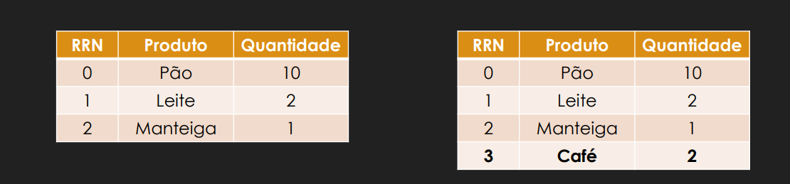
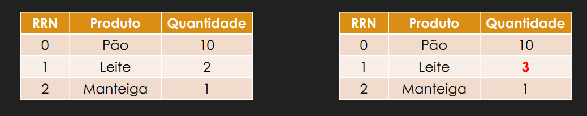
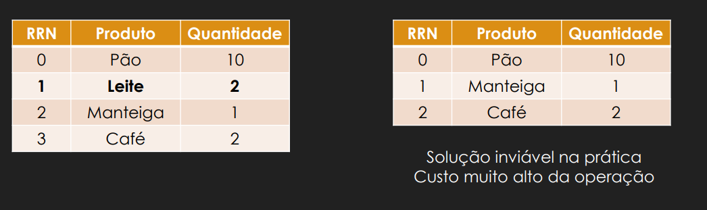
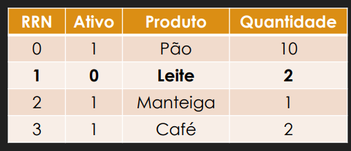
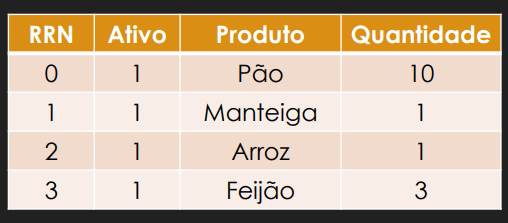
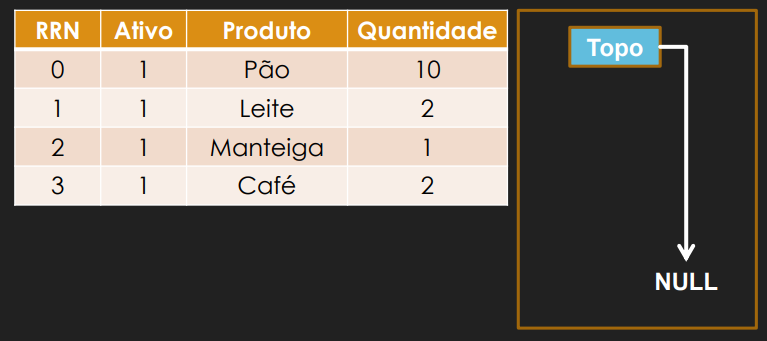
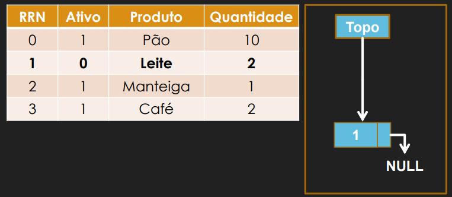
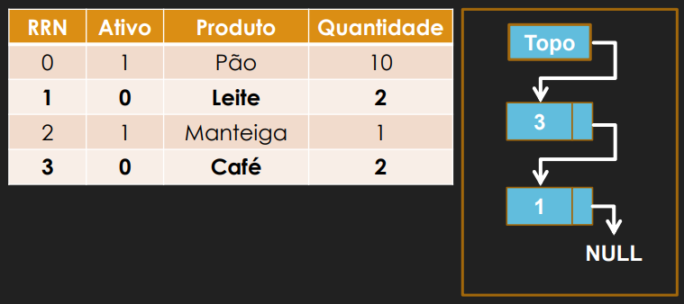
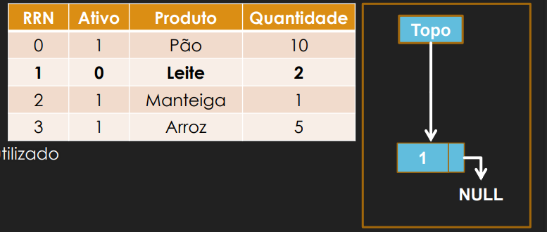
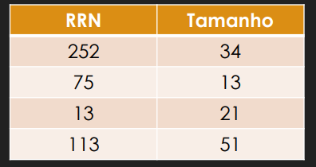

# Anotações da Disciplina de ORI

## 📑 Sumário

- [1. Armazenamento Volátil](#1-armazenamento-volátil)
  - [1.1 HD (Disco Rígido)](#11-hd-disco-rígido)
    - [Estrutura](#estrutura)
    - [Desempenho](#desempenho)
    - [Capacidade de Armazenamento](#capacidade-de-armazenamento)
    - [Tempo de Acesso](#tempo-de-acesso)
    - [Organização](#organização)
    - [Sistema FAT](#sistema-fat)
    - [Página de Disco](#página-de-disco)
    - [Recursos](#recursos)
    - [TDAA](#tdaa-tabela-descritiva-de-arquivos-abertos)
    - [TAAP](#taap-tabela-de-arquivos-abertos-por-processo)
    - [RAID](#raid-redundant-array-of-independentinexpensive-disks)
- [2. Arquivos em C](#2-arquivos-em-c)
  - [Ponteiro de arquivo](#ponteiro-de-arquivo)
  - [Comando `fopen`](#comando-fopen)
  - [Comando `fclose`](#comando-fclose)
  - [Comando `fputc`](#comando-fputc)
  - [Comando `fgetc`](#comando-fgetc)
  - [Comando `feof`](#comando-feof)
  - [Comando `fputs`](#comando-fputs)
  - [Comando `fgets`](#comando-fgets)
  - [Comando `fwrite`](#comando-fwrite)
  - [Comando `fread`](#comando-fread)
  - [Comando `fpritf`](#comando-fpritf)
  - [Comando `fscanf`](#comando-fscanf)
  - [Comando `fseek`](#comando-fseek)
- [3. Organização em Campos e Registros](#3-organização-em-campos-e-registros)
  - [Organização de arquivos](#organização-de-arquivos)
  - [Campos de tamanho fixo](#campos-de-tamanho-fixo)
  - [Campos com indicador de comprimento](#campos-com-indicador-de-comprimento)
  - [Campos separados por delimitadores](#campos-separados-por-delimitadores)
  - [Campos separados por tags](#campos-separados-por-tags)
  - [Organização de arquivos em registros](#organização-de-arquivos-em-registros)
  - [Registros de tamanho fixo](#registros-de-tamanho-fixo)
  - [Campo de tamanho fixo](#campo-de-tamanho-fixo)
  - [Campo de tamanho váriavel](#campo-de-tamanho-váriavel)
  - [Número fixo de campos e Uso de delimitadores](#número-fixo-de-campos-e-uso-de-delimitadores)
  - [Indicador de tamanho](#indicador-de-tamanho)
  - [Uso de índice](#uso-de-índice)
  - [Registro com delimitador e de campo e de registro](#registro-com-delimitador-e-de-campo-e-de-registro)
  - [Header records](#header-records)
- [4. Acesso, Manutenção e Reuso de espaço](#4-acesso-manutenção-e-reuso-de-espaço)

---

## 1. Armazenamento Volátil

### 1.1 HD (Disco Rígido)

#### Estrutura

É dividido em um conjunto de pratos empilhados, em que os dados ficam gravados em suas superfícies, as quais são divididas em trilhas, que por sua vez, são organizadas em setores. Além disso, é composto por cilindros que são o conjunto de trilhas ao longo dos pratos.

#### Desempenho

Possui alta capacidade de armazenamento, bem como um tempo de acesso um pouco melhor do que tecnologias anteriores. Além disso, oferece maior confiabilidade contra falhas.

#### Capacidade de Armazenamento

- **Capacidade do setor:** 512 bytes
- **Capacidade da trilha:** número de setores por trilha × capacidade do setor
- **Capacidade do cilindro:** número de trilhas por cilindro × capacidade da trilha
- **Capacidade do disco:** número de cilindros × capacidade do cilindro

#### Tempo de Acesso

É composto pelas seguintes etapas:

- **Busca:** tempo para posicionar a cabeça de leitura/gravação no cilindro correto
- **Latência de rotação:** demora que o disco possui para girar até o setor correto
- **Taxa de transferência de dados:** tempo para transferir os dados para a memória primária

#### Organização

Pode ser simplificada em dois tipos de formatação:

**Formatação Física:** Divide o disco em trilhas, setores e cilindros, e também pode identificar setores defeituosos.

**Formatação Lógica:** Permite a adição do Sistema Operacional e a organização do disco em regiões endereçáveis.

**Observação:** Toda a informação é organizada em blocos, em que cada bloco representa a informação a ser acessada ou escrita.

#### Sistema FAT

Tabela que organiza os blocos de informação de forma indexada. Cada arquivo é organizado em clusters (conjunto de setores no disco). A tabela:

- Organiza e indexa os blocos de dados
- Mapeia o status dos espaços da memória (livres ou ocupados)
- Aponta para o próximo bloco a ser acessado ou validado

**Vantagens:**
- Grande compatibilidade com outros sistemas
- Simples de ser implementado
- Eficiente para pequenos dispositivos

**Desvantagens:**
- Limitado quanto ao tamanho do arquivo (FAT32: máximo 4 GB)
- Tende a fragmentar arquivos grandes, causando lentidão no acesso
- Não oferece opções avançadas de segurança

#### Página de Disco

Bloco composto por dados consecutivos de tamanho fixo. É o menor bloco de dados que pode ser lido ou gravado em um dispositivo de armazenamento, sendo comumente usado para transferência de dados entre dispositivos de armazenamento ou memória.

#### Recursos

Como recursos essenciais para a unidade de armazenamento, temos:

- **Buffer:** permite que as escritas de dados na memória sejam mais eficientes, armazenando um valor temporário para que o disco volte ao setor e grave os dados sem necessidade de espera contínua
- **Organização em blocos:** setores agrupados em Extents para alocação de blocos sequenciados a um mesmo arquivo
- **Leitura antecipada:** prefetch de dados
- **Desfragmentação:** reorganização de dados fragmentados

#### TDAA (Tabela Descritiva de Arquivos Abertos)

Tabela global do sistema que mantém informações sobre todos os arquivos abertos. Cada entrada contém metadados como:

- Identificador do arquivo
- Posição atual no arquivo (offset)
- Modo de acesso (leitura, escrita, etc.)
- Informações do inode/bloco
- Referências de contagem de uso

#### TAAP (Tabela de Arquivos Abertos por Processo)

Tabela específica de cada processo que referencia quais arquivos o processo tem abertos. Cada entrada aponta para a entrada correspondente na TDAA, permitindo que o SO saiba quais arquivos cada processo está utilizando.

#### RAID (Redundant Array of Independent/Inexpensive Disks)

Técnica de combinar vários discos rígidos para melhorar performance e segurança:

- **RAID 0:** Divide dados entre discos (mais rápido, mas perda total se 1 falhar)
- **RAID 1:** Copia dados identicamente em 2 discos (espelho – seguro, mas dobra uso de espaço)
- **RAID 5:** Divide dados + paridade em 3+ discos (equilibrado, aguenta 1 disco falhando)
- **RAID 6:** Como RAID 5, mas aguenta 2 discos falhando

---

## 2. Arquivos em C

#### Ponteiro de arquivo:

``` C 
FILE *p
```
Que define um ponteiro que está apontando para o *Struct* FILE dentro da biblioteca stdio.h que é responsável por lidar com todo tipo de tratamento de arquivos.

#### Comando `fopen`

A função fopen() abre o arquivo especificado por *filename*. O parâmetro *mode* é uma sequência de caracteres que especifica o tipo de acesso solicitado para o arquivo. A variável *mode* contém um parâmetro posicional seguido por parâmetros de palavra-chave opcionais.

##### Modos:
 - **t:** Abra um arquivo de texto para leitura.. O arquivo deve existir..

 - **w:** Crie um arquivo de texto para gravação.. Se o arquivo fornecido existir, seu conteúdo será destruído, a menos que ele seja um arquivo lógico

 - **A:** Abra um arquivo de texto no modo de anexação para gravação no final do arquivo A função fopen() cria o arquivo se ele não existir e não for um arquivo lógico.

 - **r +:** Abra um arquivo de texto para leitura e gravação. O arquivo deve existir..

- **w +:** Crie um arquivo de texto para leitura e       gravação. Se o arquivo fornecido existir, seu conteúdo será limpo, a menos que seja um arquivo lógico.

 - **a +:** Abra um arquivo de texto no modo de anexação para leitura ou atualização no final do arquivo A função fopen() cria o arquivo se ele não existir.

 - **RB:** Abra um arquivo binário para leitura.. O arquivo deve existir..

 - **wb:** Crie um arquivo binário vazio para gravação.. Se o arquivo existir, seu conteúdo será limpo, a menos que seja um arquivo lógico.

 - **ab:** Abra um arquivo binário no modo de anexação para gravação no final do arquivo A função fopen cria o arquivo se ele não existir.

 - **r + b ou rb +:** Abra um arquivo binário para leitura e gravação. O arquivo deve existir..

 - **w + b ou wb +:** Crie um arquivo binário vazio para leitura e gravação. Se o arquivo existir, seu conteúdo será limpo a menos que seja um arquivo lógico.

 - **a + b ou ab +:** Abra um arquivo binário no modo de anexação para gravação no final do arquivo A função fopen() cria o arquivo se ele não existir.


```C
    file = fopen(char "filename.txt", char "r");
```

**OBS:** Na abertura de um arquivo é sempre necessário verificar se essa abertura foi eecutada com sucesso, pois caso contrário nenhuma operação seguinte será relaiza com êxito.

```C

    #include <stdio.h>
    #include <stdlib.h>

    int main(){
        FILE *file;

        file = fopen(char "filename.txt", char "r");
        if(file == NULL){
            printf("Erro ao abrir o arquivo");
            system("pause");
            exit(1);
        }

        fclose();
        return 0;
    }
```
##

#### Comando `fclose`
A função fclose() da biblioteca C é usada para fechar um fluxo de arquivo aberto. Ela fecha o fluxo e todos os buffers são liberados.

**Fluxo FILE:** Um ponteiro para um objeto FILE que identifica o fluxo a ser fechado. Este ponteiro é obtido por meio de funções como fopen, freopen ou tmpfile.

```C
    int fclose(FILE *file);
```

##

#### Comando `fputc`
A função fputc(int char, FILE *stream) da biblioteca C escreve um caractere (unsigned char) especificado pelo argumento char no fluxo especificado(arquivo atual) e avança o indicador de posição do fluxo. 

**int character:** O caractere a ser escrito. Embora seja um int, ele representa um unsigned char convertido para um valor int.

**Fluxo FILE:** Um ponteiro para um objeto FILE que identifica o fluxo de saída. Esse fluxo é normalmente criado usando funções como fopen.

```C
    int fputc(int character, FILE *file);
```

Esse comando também pode ter uma variação para escrever um caracter na tela do usuário.

```C
    int fputc(int character, stdout);
```
##

#### Comando `fgetc`
A função fgetc() da biblioteca C obtém o próximo caractere (unsigned char) do fluxo especificado(arquivo atual) e avança o indicador de posição para o fluxo. Ela é comumente usada para ler caracteres de arquivos.

**file:** Um ponteiro para um objeto FILE que identifica o fluxo de entrada. Esse fluxo geralmente é obtido abrindo um arquivo usando a função fopen.

```C
    int fgetc(FILE *file);
```

Esse comando também pode ter uma variação para ler um caracter no terminal do usuário.

```C
    int fgetc(stdin);
```

**OBS:** É necessário sempre que estivermos lendo um arquivo verificar se esse arquivo já chegou ao final para evitar problemas futuros.

```C
    FILE *file;
    char c;

    while((c = fgetc(file)) != EOF){
        printf("%c", c);
    }
```

##

#### Comando `feof`
A função `int feof(FILE *stream)` da biblioteca C testa o indicador de fim de arquivo para o fluxo fornecido.

**FILE * file:** Este é um ponteiro para um objeto FILE que identifica o fluxo a ser verificado.

```C
    int feof(FILE *file);
```

**OBS:** Tomar cuidado ao utiliza-lo, pois ele testa o valor do indicador do arquivo e não o arquivo em si, o que faz com que o uso errado possa causar um resultado não esperado.

Exemplo de uso correto:

```C
    while (!feof(file)) {
       char c = fgetc(file);
       if (feof(file)) break;
       printf("%c", c);
   }
```

##

#### Comando `fputs`
A função `int fputs(const char *str, FILE *stream)` da biblioteca C escreve uma string no fluxo especificado, incluindo, mas não se limitando ao caractere nulo. Ela é comumente usada para escrever texto em arquivos.

**const char * str:** Este é um ponteiro para a string terminada em nulo que será escrita no arquivo.

**FILE * file:** Este é um ponteiro para um objeto FILE que identifica o fluxo onde a string deve ser escrita. O fluxo pode ser um arquivo aberto ou qualquer outro fluxo de entrada/saída padrão.


```C
    int fputs(const char *str, FILE *file);
```

Esse comando também pode ter uma variação para escrever uma string na tela do usuário.


```C
    fputs(const char *str, stdout);
```

##

#### Comando `fgets`
A função fgets(FILE *stream) da biblioteca C obtém o próximo caractere (unsigned char) do fluxo especificado e avança o indicador de posição para o fluxo. Ela é comumente usada para ler dados de um arquivo ou da entrada padrão (stdin).

**char * str:** Um ponteiro para um array de caracteres onde a string lida será armazenada. Este array deve ser grande o suficiente para conter a string, incluindo o caractere nulo de terminação.

**int n:** O número máximo de caracteres a serem lidos, incluindo o caractere nulo de terminação. A função fgets lerá até n-1 caracteres, deixando espaço para o caractere nulo.

**FILE * file:** Um ponteiro para um objeto FILE que especifica o fluxo de entrada do qual ler. Pode ser um ponteiro de arquivo obtido por funções como fopen, ou pode ser stdin para entrada padrão.

```C
    char *fgets(char *str, int n, FILE *file);
```

##

#### Comando `fwrite`
A função fwrite() da biblioteca C escreve dados da matriz apontada por ptr para o fluxo fornecido.

**const void * buffer:** Ponteiro para o array de elementos a serem escritos.

**size_t byte_size:** Tamanho em bytes de cada elemento a ser escrito.

**size_t number_element:** Número de elementos, cada um com um tamanho de size bytes.

**FILE * file:** Ponteiro para o objeto FILE que identifica o fluxo onde os dados serão gravados.


```C
    unsigned fwrite(const void *buffer, size_t byte_size, size_t number_element, FILE *file);
```

##

#### Comando `fread`
A função `size_t fread(void *ptr, size_t size, size_t nmemb, FILE *stream)` da biblioteca C lê dados do fluxo fornecido para o array apontado por `ptr`. Ela é comumente usada para ler arquivos binários, mas também pode ser usada para arquivos de texto.

**buffer:** Um ponteiro para um bloco de memória onde os dados lidos serão armazenados.

**tamanho:** O tamanho, em bytes, de cada elemento a ser lido.

**numero de elementos:** O número de elementos, cada um com tamanho size bytes, a serem lidos.

**fluxo:** Um ponteiro para o objeto FILE que especifica um fluxo de entrada.

```C
    unsigned fread(void *buffer, size_t byte_size, size_t number_element, FILE *file);
```

##

#### Comando `fpritf`
A função fprintf() da biblioteca C é usada para escrever dados formatados em um fluxo. Ela faz parte da biblioteca de E/S padrão <stdio.h> e permite escrever dados em um fluxo de arquivo, diferentemente da função printf(), que escreve no fluxo de saída padrão.

**file:** Um ponteiro para o objeto FILE que identifica o fluxo onde a saída deve ser escrita.

**format:** Uma string que especifica o formato da saída. Pode conter especificadores de formato que são substituídos pelos valores especificados nos argumentos subsequentes.

**... :** Argumentos adicionais que correspondem aos especificadores de formato na string de formato.

```C
    int fprintf(FILE *file, const char *format, ...);
```

##

#### Comando `fscanf`
A função `int fscanf(FILE *stream, const char *format, ...) ` da biblioteca C lê dados formatados de um fluxo. Ela faz parte da biblioteca de entrada/saída padrão (SIL) e está definida no cabeçalho `stdio.h`. Essa função permite extrair e analisar dados de um arquivo de acordo com um formato especificado.

**file:** Este é um ponteiro para o objeto FILE que identifica o fluxo de entrada do qual os dados devem ser lidos.

**format:** Esta é uma string C que contém uma string de formatação composta por especificadores de conversão. Esses especificadores determinam o tipo e o formato dos dados a serem lidos.

**... :** Isso representa um número variável de argumentos adicionais que apontam para os locais onde os valores analisados ​​serão armazenados. Cada argumento deve corresponder a um especificador de formato na string de formato.

```C
    int fscanf(FILE *file, const char *format, ...);

```

##

#### Comando `fseek`
A função fseek(FILE *stream, long int offset, int whence) da biblioteca C define a posição do arquivo no fluxo para o deslocamento fornecido.

**FILE * file:** Um ponteiro para um objeto FILE que identifica o fluxo.

**long int offset:** O número de bytes para mover o ponteiro do arquivo.

**int wherece:** A posição a partir da qual o deslocamento é adicionado. Pode ter um dos seguintes valores:

 - **SEEK_SET:** Início do arquivo.
 - **SEEK_CUR:** Posição atual do ponteiro do arquivo.
 - **SEEK_END:** ​​Fim do arquivo.

```C
    int fseek(FILE *stream, long int offset, int whence);
```

##

## 3. Organização em Campos e Registros

### Organização de arquivos
Geralmente serão compostos por "campo", que irá representar o tipo de informação, e "registro" o qual representa o conjunto de campos.

E como prícipio fundamental em relação a organização de arquivos é de que um registro salvo não pode recuperar suas unidades lógicas, sendo que a informação se transforma em um conglomerado de caracteres, fazendo com que seja necessário a utilização de certo métodos de organização para conseguir extrair os dados realizando o mapeamento de unidade lógica.

Dessa forma temos os seguinte tipos de organização:

    - Campos de tamanho fixo
    - Campos com indicador de comprimento
    - Campos com uso de delimitadores
    - Campos com uso de tag

### Campos de tamanho fixo
Nesse método temos que cada campo ocupa um tamnho fixo de bytes do arquivo, o que de certa forma ajuda na coleta de informação pois esse tamanho do campo já é conhecido. Porém, faz com que o espaço alocado cresça exponencialmente causando desperdicio.

### Campos com indicador de comprimento
Nesse método temos que o tamanho de cada campo é salvo primeiro, sendo utilizado apenas um único byte para representar esse tamanho. É util e situações onde é necessário saber o tamanho do campo antes de ler o campo, porém, causa lentidão na leitura dos dados, uma vez que, se tem um passo a mais a ser executado.

### Campos separados por delimitadores
Nesse método temos a inserção de um caracter especial no final de cada campo, em que esse caracter não pode ser um caracter válido. Dessa forma, a vantagem de utilizar esse método é evitar campos de dados vazios, porém causa atraso na leitura de dados, pois também adiciona mais um passo de execução, além de obrigar a leitura caracter a caracter.

### Campos separados por tags
Nesse método temos a separação dos campos por uma tag do tipo "keyword=value" e adicionando um caracter especial no final do campo. Dessa forma, temos como vantagem a fácil identificação do campos e os seus valores, porém ainda mantemos o atraso de leituras pela a adição de mais um passo de leitura.

## Organização de arquivos em registros
Como dito anteriormente temos que um registro é um conjuto de campos que são agrupados de tal forma a ser manter uma associação a uma entidade lógica. E como anteriormente também temos métodos de regsitros.

    - Registros com tamanho fixo
        - campos de tamanho fixo
        - campos de tamanho variável

    - Registros com tamanho variável
        - Número fixo de campos
        - Uso de delimitadores
        - Indicador de tamanho
        - Uso de índice

### Registros de tamanho fixo
Nesse método temos um valor fixo para todos os registros, podendo ter campos de tamanho fixo ou de tamanho variável. Exemplo disso são as strucs em C.

Esse método permite acessar diretamente cada regsitro utilizando o RRN(Relative Record Number). Porém, pode causar desperdício de memória secundária.

#### Campo de tamanho fixo
**RRN**: Precisa que os campos tenham tamannho fixo para serem acessados.
- Precisa de uma posição de início do regsitro(byte offset)
- Byte offset = RRN * T

Ex: Acessar um registro na posição lógica 546, e cada campo possui tamanho 128. Logo temos:

Byte Offset = 546 x 128 = 69.888 bytes

#### Campo de tamanho váriavel
Nesse método temos o acréscimo de um espaço vazio ao final de cada campo.

### Registros com tamanho variável

#### Número fixo de campos e Uso de delimitadores
Nesse método temos que cada registro possui um número fixo de campos, em que o tamanho do resgitro é variável, podendo ser combinada com uma estrutura de tamanho de variável do campo. Além de possuir um delimitador para separar os campos. Dessa forma, a vantagem de método é te campos sem espaços vazios, mas as possui como desvantagens o overhead, necessidade de tratamento dos delimitadores e a necessidade de leitura do byte de tamanho.

#### Indicador de tamanho
Nesse método temos a utlização de um indicador de tamanho na frente de cada registro, e os campos são separados internamente por separadores. Dessa froma, a vantagem é ter campos de dados sem espaços vazios, oferece solução para registros de tamanho variável e permite acesso direto ao registro seguinte. E como desvantagem temos o overhead.

#### Uso de índice
Nesse método temos a utilização de um arquivo secundário que armazena o endereço do primeiro byte de cada registro. Além de fazer o uso de delimitadores para os campos e indica o deslocamento de cada registro referente ao inicio do arquivo. Dessa forma, temos como vantagem a flexibilidade e como desvantagem é a necessidade de usar 2 arquivos além de passo a mais de pesquisa.

### Registro com delimitador e de campo e de registro
Nesse método temos a utilização de dois tipos de delimitadores que devem ser diferentes entre si, em que um sera para delimitar cada campo e um para cada regsitro. Dessa forma, temos como vantagem campos sem espaços vazios e permite um número variável de campos e como desvantagem temos o overhead, leitura byte a byte e filtrar os delimitadores.

### Header records
Serve para guardar a estrutura do arquivo em um cabeçalho

- Arquivo TIF: Amazena várias imagens dentro de um arquivo.


## 4. Acesso, Manutenção e Reuso de espaço

### Registro de campos com tamanho fixo

### Manipulação de dados

    - Inserção
    - Atualização
    - Remoção

#### Inseção


#### Atualização


No caso de acrecimo de tamanho ou campo de tamanho variável é necessário remover o registro para que ele seja atualizado.

## Remoção
 - ### Reorganização imediata
    

    Elimina o registro e reoganiza o indice dos regitros que se mantiveram.

 - ### Compactação e reuso
    A compactação busca por regiões do aquivo que não há dados e recupera os dados perdidos.

    - Reuso estático
    - Reuso dinâmico
        - Tamanho fixo
        - Tamanho variável

 - ### Reuso estático
    Utiliza de um campo a mais para usar de estado para o registro para identificar campos removidos.

    Usa da remoção lógica, sendo a remoção do registro, gerando espaços inuteis e reagrupa os registros.

     - O registro é marcado para ser removido.
     - Depois de determinado tempo, o sistema remove o registro marcado.
     - Após as remoção e feita a reorganização do indeces e feita a compatação do arquivo para remover os espaços vázios.

    ###

    **OBS:** Antes de ser removido o registro marcado pode ser feita inserções que serão reorganizadas na remoção.

    ####

     
    

 - ### Reuso dinâmico

    - Tamanho fixo: 
        Utilização de lista encadeada para registros elimindados.

        No reuso dinâmico temos uma lista composta por RRNS marcados como removidos, armazena o cabeçalho do arquivo na cabeça da lista e inserção e reuso são feitas sempre no início da lista.
        ###
        
        
        
        
        ###
    - Tamanho variável:
        Como no tamanho fixo também precisamos de uma lista encadeada para os registros eliminados.
        Além disso mantemos a utilização de RRNS aramazendo o cabeçalho do arquivo na cabeça da lista, mas nesse caso precisamos guardar o tamanho do regsitro e a inserção será feita no início da lista.
        ###
        * Atualização
            - Se tamanho do registro é suficiente, ocorre no próprio registro; senão, remove e inclui
        ###
        * Reuso de espaço
            - Realiza uma busca sequencial na lista
            - Se encontrou espaço disponível no tamanho adequado
            - Então reaproveita o espaço para armazenar o novo registro, usando uma estratégia de alocação
            - Senão insere o novo registro no final do arquivo
            - O tamanho do registro que foi removido deve ser do tamanho adequado, ou seja, “grande o suficiente” para que os dados do novo registro usem aquele espaço
        ###
        * Estratégias de Alocação
            - First-Fit: Utiliza o primeiro espaço que tiver tamanho suficiente
            - Best-Fit: Escolhe o espaço mais justo possível
            - Worst-Fit: Escolhe o maior espaço possível

        ###
        
###

#### Fragmentação interna
 - Espaço que sobra dentro de um registro
 - Colocar o espaço que sobrou na lista encadeada como um registro eliminado

#### Fragmentação externa
 - O espaço que sobrou dentro de um registro que foi colocado na lista encadeada como um registro
 eliminado
 - O espaço é muito pequeno, e não pode armazenar nenhum dado

## 5


